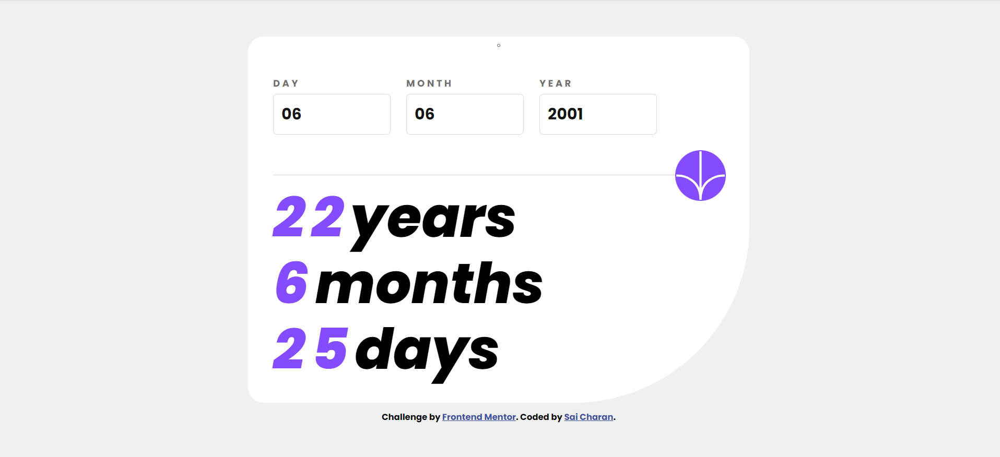

# Frontend Mentor - Age calculator app solution

This is a solution to the [Age calculator app challenge on Frontend Mentor](https://www.frontendmentor.io/challenges/age-calculator-app-dF9DFFpj-Q). Frontend Mentor challenges help you improve your coding skills by building realistic projects. 

## Table of contents

- [Overview](#overview)
  - [The challenge](#the-challenge)
  - [Screenshot](#screenshot)
  - [Links](#links)
- [My process](#my-process)
  - [Built with](#built-with)
  - [What I learned](#what-i-learned)
  - [Continued development](#continued-development)
  - [Useful resources](#useful-resources)
- [Author](#author)
- [Acknowledgments](#acknowledgments)

**Note: Delete this note and update the table of contents based on what sections you keep.**

## Overview

### The challenge

Users should be able to:

- View an age in years, months, and days after submitting a valid date through the form
- Receive validation errors if:
  - Any field is empty when the form is submitted
  - The day number is not between 1-31
  - The month number is not between 1-12
  - The year is in the future
  - The date is invalid e.g. 31/04/1991 (there are 30 days in April)
- View the optimal layout for the interface depending on their device's screen size
- See hover and focus states for all interactive elements on the page
- **Bonus**: See the age numbers animate to their final number when the form is submitted

### Screenshot



### Links

- Solution URL: [Git hub](https://github.com/saicharan293/FrontendMentorIO/tree/main/profile-card-component-main)
- Live Site URL: [Netlify](https://your-live-site-url.com)

## My process

### Built with

- Semantic HTML5 markup
- CSS custom properties
- Flexbox
- CSS Grid
- Java Script

### What I learned

I learnt how to use pseudo elements such as focus for input tag in css, and other major learning lies in writing the java script code to validate the day if the month isn't entered yet and user tries to submit only the day element input. I took a lot of time to process the next step as I go into writing the code, and usage of Date() function helped me to understand better about its usage rather than going for a static method to count the maximum days of any month entered by user

These are the code snippets:


```css
input {
  width: 150px;
  border-radius: 5px;
  padding: 10px;
  border: 1px solid hsl(0, 0%, 86%);
  color: hsl(0, 0%, 8%);
  font-size: 20px;
  text-transform: uppercase;
}
input:focus{
    outline: 1px solid hsl(259, 100%, 65%);
}
.error{
  color: hsl(0, 100%, 67%);
  font-size: 12px;
  font-style: italic;
  padding-top: 5px;
}
```
```js
function validation() {
  let monthEntered = false;
  const inputArray = Array.from(inputFields);
  inputArray.forEach((input, index) => {
    const inputValue = parseInt(input.value, 10);
    clearError(index);
    // check if the input field is empty or not a number 
    if (isNaN(inputValue) || input.value.trim() === "") {
      displayError(index, "This field is required");
      return false;
    } else {
      // Validate day, month, and year based on their respective indices
      if (index === 0) {
        monthEntered = true;
        return validateDay(inputValue, index, monthEntered);
      } else if (index === 1) {
        return validateMonth(inputValue, index);
      } else if (index === 2) {
        return validateYear(inputValue, index);
      }
    }
  });
  return true;
}
```


If you want more help with writing markdown, we'd recommend checking out [The Markdown Guide](https://www.markdownguide.org/) to learn more.


### Continued development

Use this section to outline areas that you want to continue focusing on in future projects. These could be concepts you're still not completely comfortable with or techniques you found useful that you want to refine and perfect.
I want to learn more about Date function and its behavior when used in other functions to retrieve information about time or time elements(date, year, month etc). And also the validation process need to be improved.


### Useful resources

- [Git hub](https://www.w3schools.com/jsref/event_onkeydown.asp) - This helped me for understanding the way that as I press "Enter" key on key board, it will submit the details. Even though this process isn't stated in the requirements list, I was curious how this works parellel to mouse click for submit

## Author

- Website - [Sai Charan Amudala](https://fmioagecalculator.netlify.app/)
- Frontend Mentor - [@saicharan293](https://www.frontendmentor.io/profile/saicharan293)


