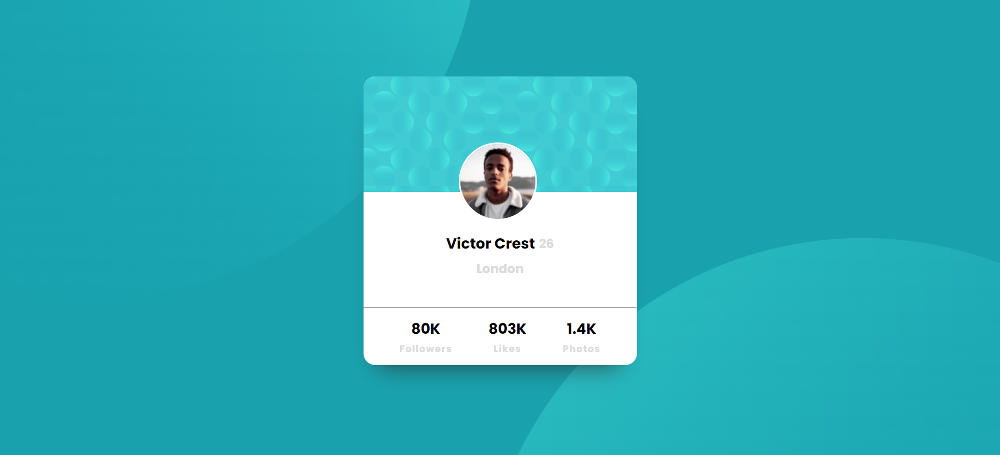

# Frontend Mentor - Profile card component solution

This is a solution to the [Profile card component challenge on Frontend Mentor](https://www.frontendmentor.io/challenges/profile-card-component-cfArpWshJ). Frontend Mentor challenges help you improve your coding skills by building realistic projects. 

## Table of contents

- [Overview](#overview)
  - [The challenge](#the-challenge)
  - [Screenshot](#screenshot)
  - [Links](#links)
- [My process](#my-process)
  - [Built with](#built-with)
  - [What I learned](#what-i-learned)
  - [Continued development](#continued-development)
  - [Useful resources](#useful-resources)
- [Author](#author)
- [Acknowledgments](#acknowledgments)

## Overview
Very good sample to practice HTML in accordance to CSS.
### The challenge

- Build out the project to the designs provided

### Screenshot

### Links

- Solution URL: [Git hub](https://github.com/saicharan293/FrontendMentorIO/tree/main)
## My process
- I considered the background as main section
- Main section contain a subsection with id center and is placed at the center of page using display=flex in css
- I divided subsection into three parts and before that I displayed profile pic which will be floating on subsection, done by using position as absolute
- subsection is divided into center 1 (height: 40%), center 2(height: 40%), center3 (height: 20%)
- center 2 holds Name, numerical value and place
- center 3 holds the details of the profile

### Built with

- Semantic HTML5 markup
- CSS custom properties
- Flexbox

### What I learned

I learned how to position the image over the center 1 (section), and an interesting thing is that I gave the same id name to the three subsection in center 3 since their styling looked similar and it worked wonderful.

### Continued development

I want to develop few other projects so that I can more clear understanding in building the projects using frame work up ahead.

### Useful resources

- [Css Generator](https://cssgenerator.org/box-shadow-css-generator.html) - This helped me to create box shadow with desired blurness and spread radius. I really liked this pattern and will use it going forward.

## Author

- Git hub - [Sai charan](https://github.com/saicharan293/FrontendMentorIO/tree/main)
- Frontend Mentor - [@yourusername](https://www.frontendmentor.io/profile/yourusername)
- Linkedin - [@amudala-sai-charan-14860a17b](www.linkedin.com/in/amudala-sai-charan-14860a17b)

## Acknowledgments

I have followed few youtube tutorials such as Sheriyans coding school and I tried to get the similar output as per teacher in the videos.

